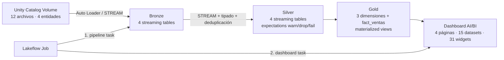

# Pipeline end-to-end de ventas retail en Databricks

Proyecto final de **Luis Enrique Saavedra Jaimes**. Implementa un pipeline
incremental Bronze → Silver → Gold con Lakeflow Spark Declarative Pipelines,
calidad de datos, esquema estrella, Job de orquestación, dashboard AI/BI y
Databricks Asset Bundle.

Repositorio: [github.com/lsaavedra7/ventas-retail-databricks](https://github.com/lsaavedra7/ventas-retail-databricks)

## Arquitectura



## Datos y modelo

- `clientes`: 66 filas, CSV, 3 batches.
- `productos`: 60 filas, CSV, 3 batches.
- `pedidos`: 66 filas, JSON, 3 batches.
- `detalle_pedidos`: 72 filas, JSON, 3 batches.
- Auditoría local: 0 duplicados de PK y 0 claves foráneas huérfanas.

El grano de `gold.fact_ventas` es una línea de pedido (`order_item_id`).
Las llaves `customer_key`, `product_key` y `date_key` enlazan con
`dim_cliente`, `dim_producto` y `dim_fecha`.

## Objetos de Unity Catalog

| Capa | Esquema | Objetos |
|---|---|---|
| Landing | `dbassociate.landing` | Volume `raw_data` |
| Bronze | `dbassociate.bronze` | `clientes_raw`, `productos_raw`, `pedidos_raw`, `detalle_pedidos_raw` |
| Silver | `dbassociate.silver` | `clientes`, `productos`, `pedidos`, `detalle_pedidos` |
| Gold | `dbassociate.gold` | `dim_cliente`, `dim_producto`, `dim_fecha`, `fact_ventas` |

Ruta de los archivos:

```text
/Volumes/dbassociate/landing/raw_data/ventas_retail_luissaavedra/{entidad}/
```

## Calidad de datos

Silver valida estructura y formato. Gold valida integridad dimensional y
coherencia de métricas.

| Severidad | Ejemplos implementados |
|---|---|
| `warn` | email válido, stock no negativo, total de pedido no negativo |
| `drop` | segmento/estado permitidos, cantidad positiva, descuento en rango |
| `fail` | claves primarias y llaves dimensionales no nulas |

## Estructura

```text
.
├── README.md
├── databricks.yml
├── resources/
│   ├── pipeline.yml
│   ├── job.yml
│   └── dashboard.yml
├── src/transformations/
│   ├── 01_bronze.py
│   ├── 02_silver.py
│   └── 03_gold.py
├── setup/00_setup.sql
├── dashboard/dashboard_gold.lvdash.json
├── data/{clientes,productos,pedidos,detalle_pedidos}/
├── docs/data_dictionary.md
└── scripts/upload_data.ps1
```

## Despliegue reproducible

### 1. Requisitos

- Git.
- Databricks CLI `0.218.0` o posterior.
- PowerShell 5.1 o posterior.
- Un workspace de Databricks con Unity Catalog, Lakeflow Declarative
  Pipelines, un SQL Warehouse y permisos para crear los objetos del proyecto.

### 2. Clonar y autenticar

```powershell
git clone https://github.com/lsaavedra7/ventas-retail-databricks.git
cd ventas-retail-databricks
databricks auth login --host https://<workspace>.cloud.databricks.com --profile <perfil>
```

El bundle no contiene una URL de workspace ni un ID de warehouse particulares.
Ambos se toman de los argumentos del usuario que realiza el despliegue.

### 3. Crear infraestructura y cargar datos

1. Ejecutar `setup/00_setup.sql` en Databricks SQL.
2. Cargar los 12 batches al Volume:

   ```powershell
   .\scripts\upload_data.ps1 -Profile <perfil> -DatabricksExecutable databricks
   ```

### 4. Validar, desplegar y ejecutar

1. Validar y desplegar el bundle indicando el perfil y el warehouse:

   ```powershell
   databricks bundle validate --profile <perfil> --var "warehouse_id=<id>"
   databricks bundle deploy --profile <perfil> --var "warehouse_id=<id>"
   ```

2. Ejecutar el Job:

   ```powershell
   databricks bundle run ventas_retail_orchestracion --profile <perfil> --var "warehouse_id=<id>"
   ```

El dashboard se despliega desde
`dashboard/dashboard_gold.lvdash.json` y consulta exclusivamente las tablas
Gold. El Job ejecuta primero el pipeline y después refresca el dashboard.

## Dashboard analítico

El dashboard publicado contiene cuatro páginas:

- **Resumen ejecutivo:** ventas, pedidos, unidades, ticket promedio, clientes,
  productos, tendencia diaria, categorías y canales.
- **Clientes y geografía:** segmentos, países, top de clientes y rendimiento
  por ciudad.
- **Productos e inventario:** ranking de productos y subcategorías, ventas,
  stock, rotación y cobertura.
- **Operación y calidad:** estados de pedido, impacto de descuentos,
  reconciliación cabecera-detalle y cobertura del esquema estrella.

El diccionario detallado está en [`docs/data_dictionary.md`](docs/data_dictionary.md).
